# Pocket POD Online Editor

This project is a replacement Pocket POD editor for your browser.  
No need to install and works also on a mobile device.  

Works also with a mobile device     

## Live App

You will find a live app at https://pocket-pod.web.app/  .   
It will immediately work with the Pocket POD if attached to your PC, laptop or mobile device.  

[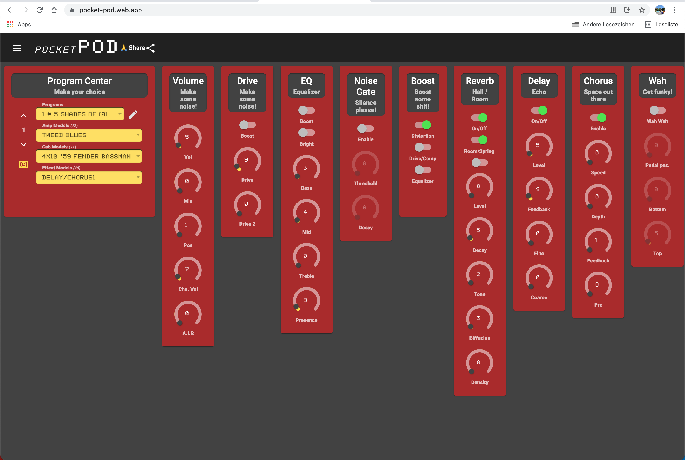](https://pocket-pod.web.app/)

Small preview how it works  

Here is a more detailed video with sound (sorry for bad audio quality):  
[Download pocketpod-walktrough.mov](./readme/pocketpod-walktrough.mov)

## Prerequisites

This app requires you to enable MIDI support in your browser.  
This little tutorial shows how to do this on a desktop browser.  

1. Notice the popup showing **MIDI is not enabled**
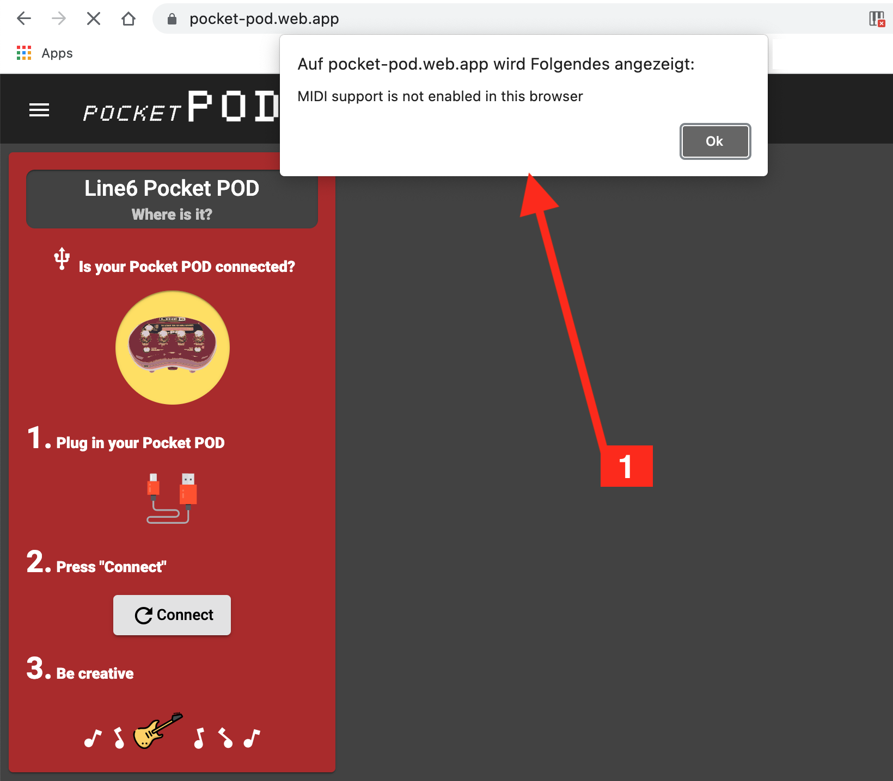

2. **Allow** usage of **MIDI devices**
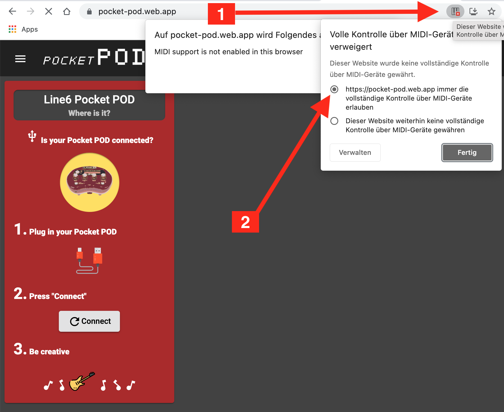

3. **Reload** app  
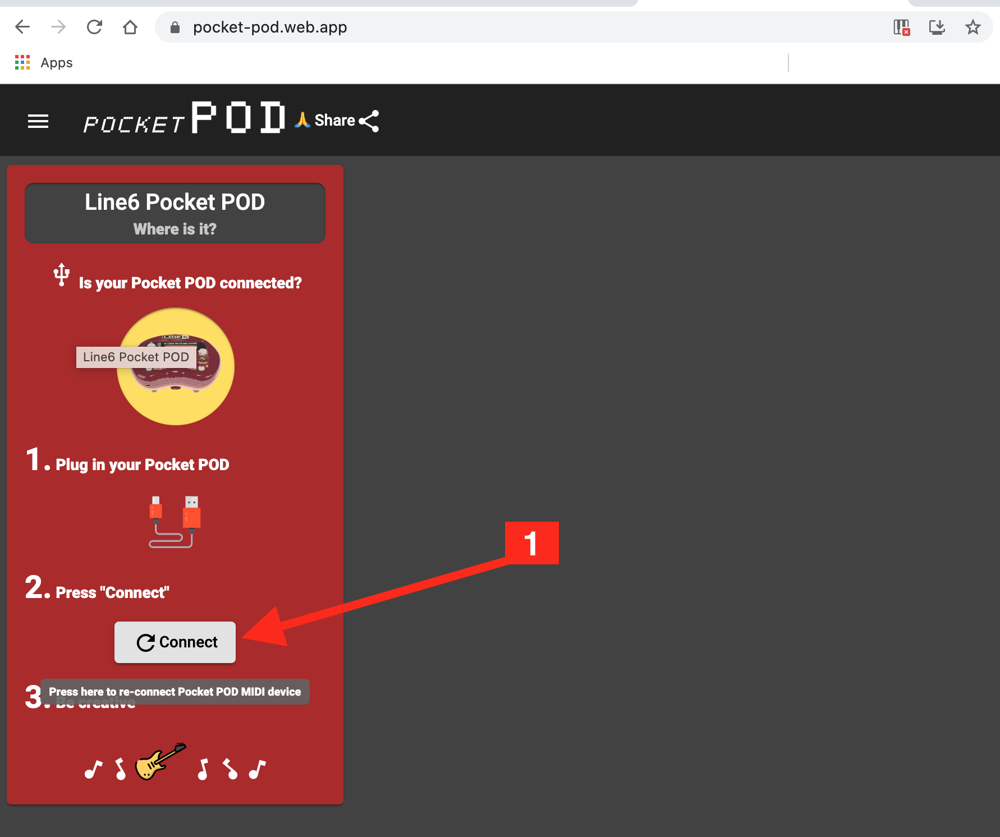

## Layout variants
1. **Card layout**  
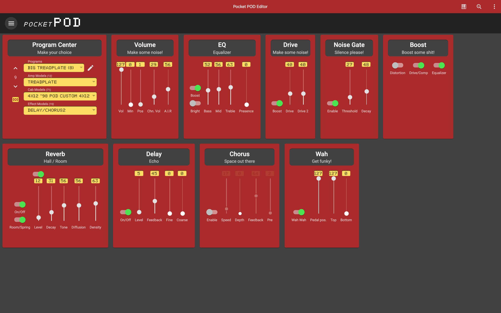
2. **Columns layout**  
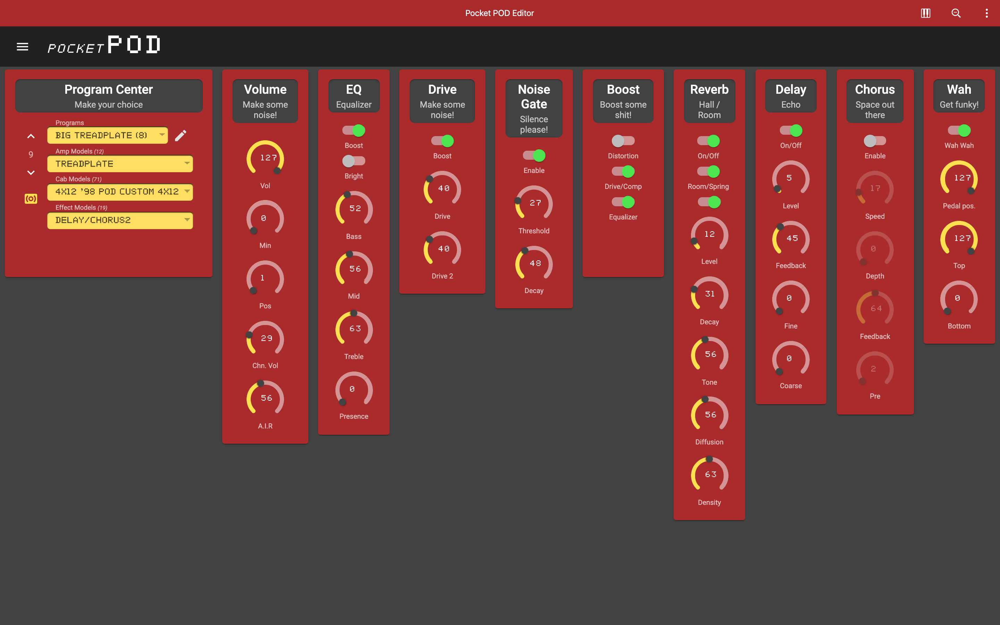

You can play with a view layout variants to find one that pleases you  
1. **Responsive cards with round gauges** (default)
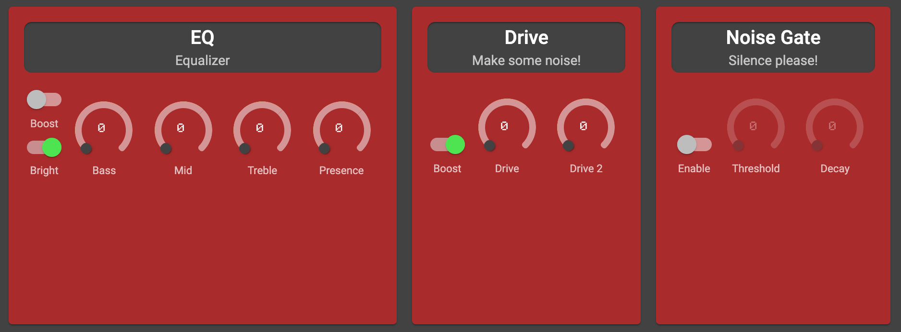
2. **Responsive cards with vertical sliders**
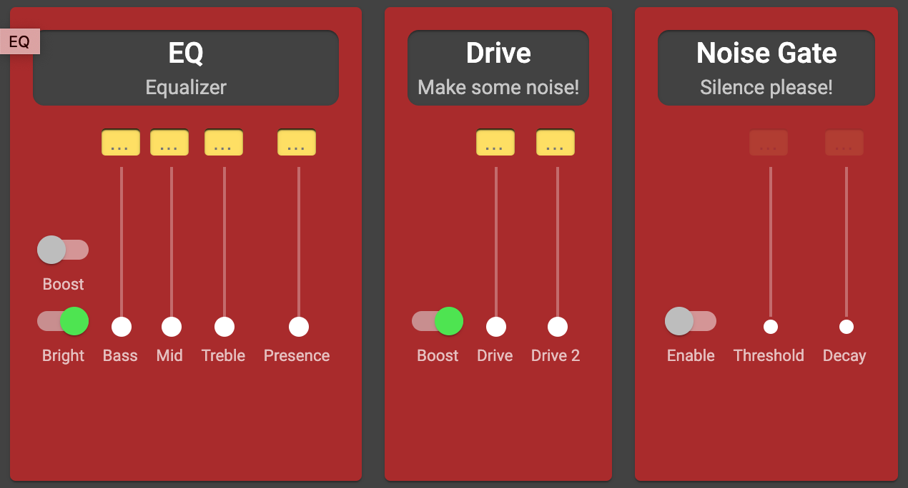
3. **Responsive cards with input fields**
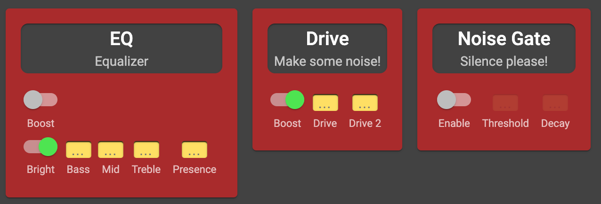
4. **Vertical colums layout**  
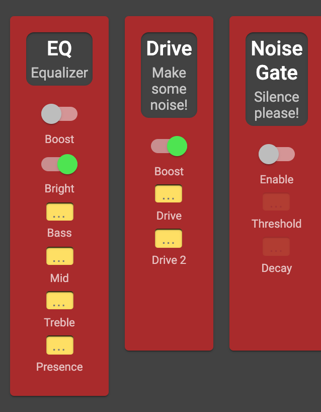

## Setting
All app settings are hidden into the menu (navigation drawer)
1. **Click the hamburger icon**
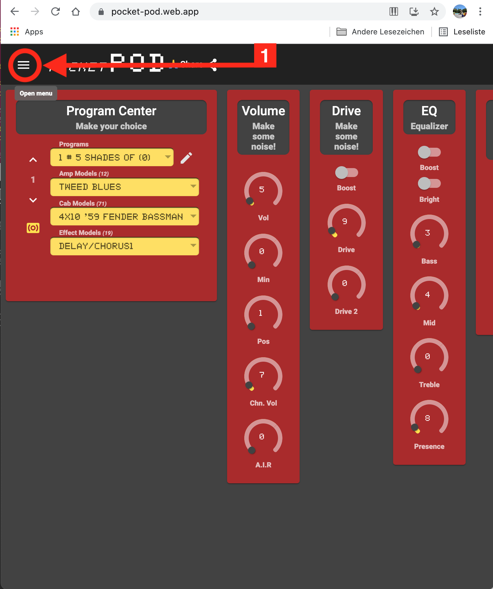
2. **Menu open**  
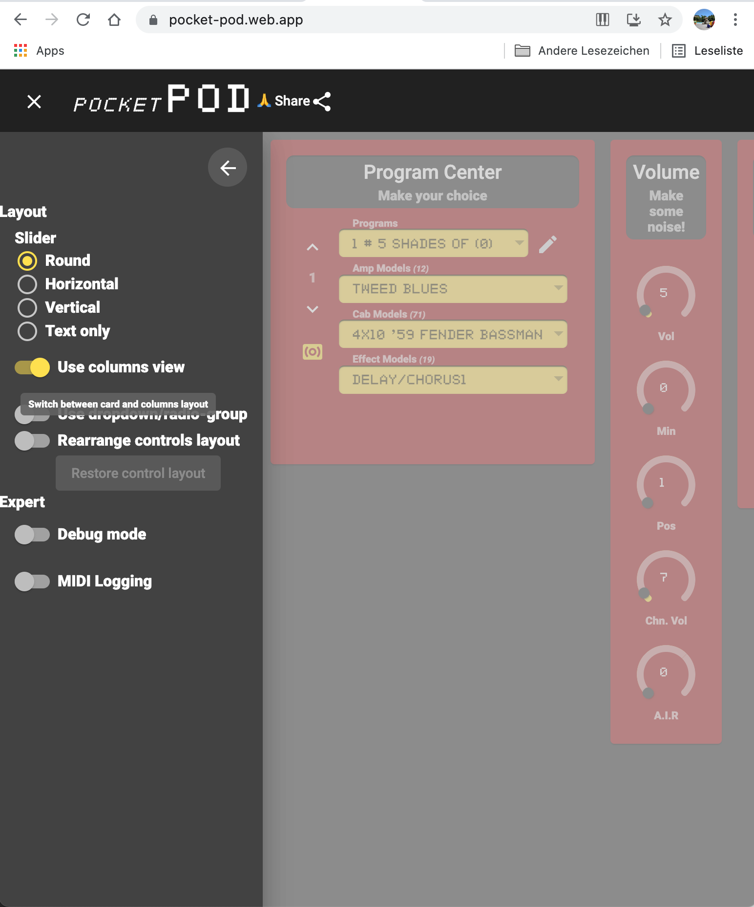

## Dev

This projects also contains a stock of UI widgets to create MIDI Controls.  
See [./UI_MIDI_CONTROLS.MD](UI_MIDI_CONTROLS.MD) for examples.